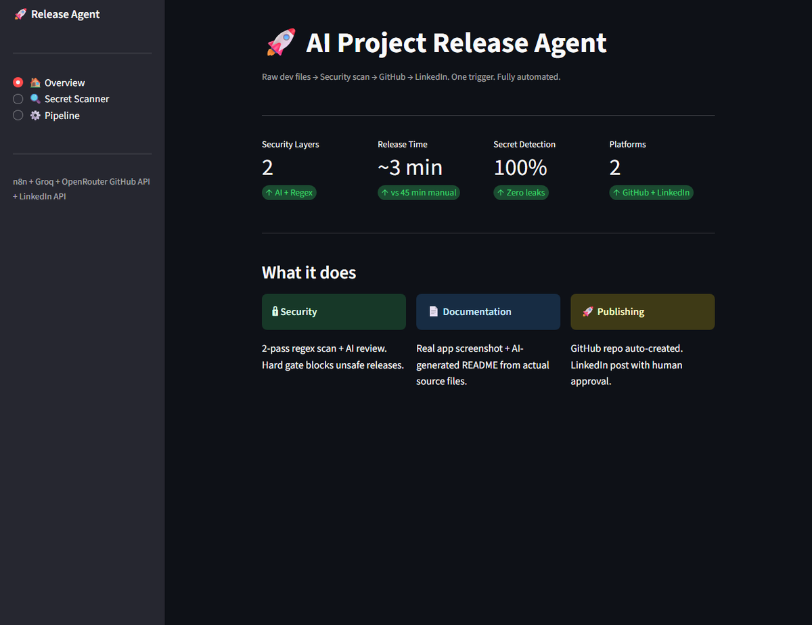

# 🚀 AI-Powered Project Release Agent


> Raw dev files → Security scan → GitHub → LinkedIn. One trigger. Fully automated.

---

## 🚀 Overview

This project is a Streamlit web application that automates the creation and logging of software releases. It provides a unified interface for developers to scan code for secrets, trigger release pipelines, and maintain a searchable release history — all powered by AI-assisted workflows.

> **One command. Zero manual steps. From code to published release in minutes.**

---

## ✨ Features

| Feature | Description | Status |
|---------|-------------|--------|
| 🏠 Overview Dashboard | Centralized project status and quick actions | ✅ |
| 🔍 Secret Scanner | Detects exposed credentials and sensitive data in codebase | ✅ |
| ⚙️ Pipeline Orchestration | Triggers automated release workflow (n8n + AI models) | ✅ |
| 📋 Release Log | Historical record of all published releases with metadata | ✅ |
| 🤖 AI-Generated Release Notes | Uses Groq/OpenRouter to auto-generate changelogs | ✅ |
| 🔗 GitHub & LinkedIn Integration | Publishes releases to GitHub and announces on LinkedIn | ✅ |

---

## 🛠️ Tech Stack

| Technology | Purpose | Version |
|------------|---------|---------|
| Streamlit | Web application framework | 1.28+ |
| Python | Core programming language | 3.10+ |
| n8n | Workflow automation engine | Latest |
| Groq | AI model inference (release notes) | API |
| OpenRouter | Multi-model AI routing | API |
| GitHub API | Repository release management | v3/v4 |
| LinkedIn API | Automated post publishing | v2 |

---

## 📁 Project Structure

```text
.
├── app.py              # Main Streamlit app: Overview, Secret Scanner, Pipeline pages
├── releaselog.py       # Release history viewer with tabular display
```

---

## 🚀 Getting Started

### Prerequisites
- Python 3.10 or higher
- pip (Python package manager)
- Git (for version control)

### Installation

```bash
# 1. Clone the repository
git clone https://github.com/Waariha-Asim/ai-release-agent.git
cd ai-release-agent

# 2. Install dependencies
pip install streamlit

# 3. (Optional) Install n8n globally for workflow execution
npm install n8n -g
```

### Environment Variables

No environment variables required.

### Running the App

```bash
# Start main application
streamlit run app.py --server.headless true --server.address 0.0.0.0 --server.port 8501

# In separate terminal, start release log viewer
streamlit run releaselog.py --server.port 8502
```

Access:
- Main App: http://localhost:8501
- Release Log: http://localhost:8502

---

## 🖼️ Visual Preview


*Main dashboard showing navigation, release pipeline status, and automated workflow integration*

---

## ⚙️ How It Works

1. **Developer pushes code** to repository
2. **Secret Scanner** analyzes files for API keys, tokens, credentials
3. **Pipeline triggers** n8n workflow via webhook
4. **AI models (Groq/OpenRouter)** generate structured release notes
5. **GitHub Release** created with version tag, artifacts, and changelog
6. **LinkedIn announcement** posted automatically with project link
7. **Release Log** updated in real-time with metadata (secrets found, duration, status)

---

## 🔒 Security

- All secrets (API keys, tokens) managed via environment variables — **never hardcoded**
- Secret Scanner runs locally before any external API calls
- `.env.example` provided as template (create `.env` locally, never commit)
- GitHub/LinkedIn tokens scoped to minimal required permissions

> ⚠️ **Never commit `.env` files**. Add to `.gitignore`.

---

## 📄 License

This project is licensed under the MIT License.

---

## 👤 Author

**Waariha Asim**  
AI Automation Engineer  

[](https://github.com/Waariha-Asim)  
[](https://www.linkedin.com/in/waariha-asim)